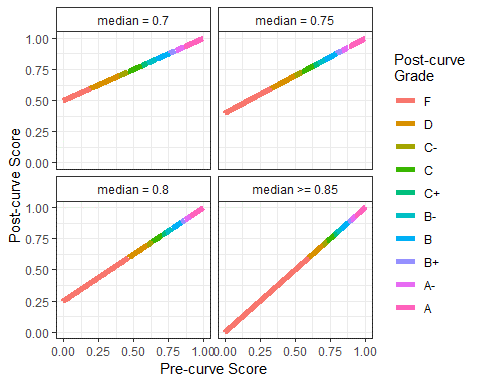

# **Canvas Picture, Syllabus, and Student Info**

Review the Syllabus on Canvas and answer the following questions:

I, *Sihyuan Han*, have:
  
  1. Added a photo of myself (head shot) to my Canvas profile
  2. Reviewed the syllabus and the associated policies on the following date:2020-09-03
  3. Reviewed the American University policies on academic integrity, and understand how they apply to this course and agree to comply with them for this course
  4. Filled in my information in the Student Info spreadsheet on Canvas collaborations
  
******
  
# **STAT 412/612 Statistical Programming in R, Fall 2020**

**2.1 Administrative Information**

**Time**: 5:30 - 8:00 pm

**Instructor**: Dr. Richard Ressler

  * Email: [rressler@american.edu](rressler@american.edu)
  
  * Office: On Zoom
  
  * Phone: Canvas Chat or Direct Message
  
  * Office Hours: *By Appointment Only, on Zoom*
    
**2.2 Materials**

  * Required Hardware and Software:
    + *Computer capable of running R 4.0*
    + Current version of R
    + Current version of RStudio
    + Current version of tinytex or LaTeX
  
  * Books and other references are free and online:
    + See the following URL: [R for Data Science by Wickham and Grolemund (O’Reilly)](http://r4ds.had.co.nz/%20and%20style.tidyverse.org)

**2.3 Grading**

**2.3.1 Attendance and Engagement**
  
  * Attendance at each class is expected.
  * If I am unable to make it I will notify the instructor in advance if at all possible.           If unable to do so, I will inform the instructor using Canvas Direct Message as soon            as possible after class.

**2.3.2 Homework Assignments**
    
  * There will be approximately nine homework assignments throughout the semester of varying possible scores
  * Each will require me to submit a properly-knitted PDF file and the original .Rmd file on Canvas
  * I may receive assistance from tutors, other students, and the professor, but *my submissions must be composed of my own thoughts, coding, and words*
  * If I have to copy code from an online resource such as stackoverflow, I will cite my source and be specific about which pieces of code I copied and any changes I made to them. Failure to do so is a violation of AU’s Academic Integrity Code.
  * Late assignments will be accepted but **there will be a scoring penalty**
      
**2.3.3 Final Project**

  * My project will involve working with 2-4 classmates on a fairly large real-world dataset to answer some question of interest.
    
**2.3.4 Final Grades**

  * I should be able to explain my work on assignments and the project and my rationale.           Based on my explanation (or lack thereof), the professor may modify my grade
  * My final grade will be determined by:
      
**Element**              | **412** | **612**
------------------------ | ------- | ------
Attendance and Engagement| 10%     | 5%
Assignments              | 60%     | 60%
Final Project            | 30%     | 35%

**2.3.5 Possible Curve**
  
The final grades may be based on a curve if the median is below 85. A visual representation of possible curves follows:
    


**2.4 Other Notes**
  
  * Sometimes we may need to type in-line math expressions such as $A=\pi*r^{2}$
  * We may also write equations using display form as $$ \bar{x} = 1/n \sum_{n=1}^n x_i $$
  * We may also need to refer to code in a text block as one can find the number of cars in the mtcars built-in dataset using the nrow() function

******

# **Exercises using R**

**Complete the following exercises using R**
    
1. 

```{r}
int <- seq(from=36,to=333)/3
int[!int%%1]
a <- int[!int%%1]
sum(a)
```

2. 

```{r}
seq(from=36,to=333,by=3)
b <- seq(from=36,to=333,by=3)
sum(b)
```

3. 

```{r}
a[59]
```

4.

```{r}
a[39:69]
```

5. 

```{r}
a+b
c <- a+b
```


6.

```{r}
length(c)
```

7.

```{r}
sum(log(c))
```


8.

```{r}
c(2,3,4)
c("Amy","Betty","Cindy")
vec1 <- c(2,3,4)
vec2 <- c("Amy","Betty","Cindy")
data.frame(vec1,vec2)
dataframe1 <- data.frame(vec1,vec2)
sum(vec1)
```


    